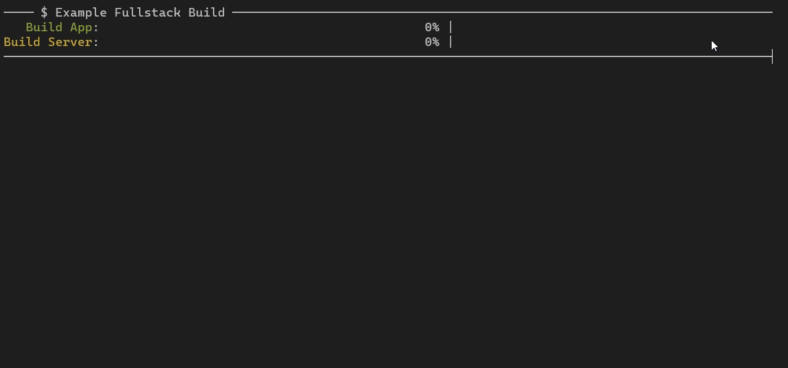

# multi-progress-bars
 

A node utility written in Typescript for displaying multiple progress bars, and preserving logged output. The progress bars can be anchored to the top or bottom of the terminal, with border options and indefinite progress display. A Promise will resolve when all tasks are done. This utility is enabled by a simple virtual console that intercepts the normal console. See the below demo .gifs.

___

Anchoring to the top. Notice how the logs are preserved:



---

Anchoring to the bottom:


---

Showing off borders customizability and overflow management:


## Install
`npm install multi-progress-bars`<br>
or<br>
`yarn add multi-progress-bars`

## Quickstart
```
import { MultiProgressBars } from 'multi-progress-bars';
import * as chalk from 'chalk';

// Initialize mpb
const mpb = new MultiProgressBars({
    initMessage: ' $ Example Fullstack Build ',
    anchor: 'top',
    persist: true,
    border: true,
});

// Add tasks
mpb.addTask('Webpack Backend', { type: 'percentage', barColorFn: chalk.yellow });
mpb.addTask('Watcher', { type: 'indefinite', message: 'Watching for changes...' });

// Update tasks
mpb.updateTask('Webpack Backend', { percentage: 0.2 });
mpb.incrementTask('Webpack Backend', { percentage: 0.1 });

// Console logging is overridden and tracked with an interval buffer
console.log('Warning!');

setTimeout(() => { mpb.done('Webpack Backend', { message: 'Build finished.' })}, 5000);
setTimeout(() => { mpb.done('Watcher', { message: 'Build finished.' })}, 1000);

// Wait for all tasks to finish
await mpb.promise;
console.log('Finish');

```
See the [Documentation](#documentation) for more information.


## Version Changes

<br>

> ## :warning: v4 -> v5 has **breaking changes**.<br>
>* Library now defaults to ESM. Dependencies on chalk and related libraries are now updated to the latest, which default to ESM.
>* For building, node needs to be >14.18 because of Rollup 3

<br>

> ## :warning: v3 -> v4 has **breaking changes**.<br>
> **User-Facing Changes**:
>* `barColorFn` is now `barTransformFn`, and a new property `nameTransformFn` has been added to transform task names appearance.
>* Number of progress bars displayed will be truncated to terminal height (accounting for borders)
>* Upon exiting, will dump the full untruncated list of progress bars if the above was true.
>* API added for removing tasks, with option to shift up the tasks or leave a blank line.
>* API added for getting the index of a specific task, or getting the name of a task given the index.
>* Extra border options in constructor as well as API to set or remove headers and footers.
>* Bottom-anchored progress bars now has bottom border if `border` is set to `true` in the constructor.

<br>

> :warning: v2 -> v3 technically has **breaking changes** in behavior nuance, but should be backwards-compatible. The changes are the addition of anchor position, border, and persist. If you pass in `true` for persist, you should call `mpb.close()` when you are done, or on `SIGINT` for example. Multi-line init messages are now clamped to the first line.

<br>

## <span name="documentation">Documentation</span>

* [Usage guide](docs/Usage.md)
* [API guide](docs/API.md)
* [Changelog](CHANGELOG.md)
* [Examples](docs/Examples.md)

## Hilbert Spinner

Included in this library is a (imo) cool Hilbert Curve / Space-Filling Curve spinner. It uses the Braille dots to do a little snake that crawls throughout the bar. There is probably a more efficient way to code the crawling, as this uses sort of an 'implicit' approach, instead of an 'explicit', which might require less calculation.

## License

[MIT](LICENSE)

## Like this utility? Support my hobby!

[PayPal donation link](https://paypal.me/seanchenpiano?locale.x=en_US)